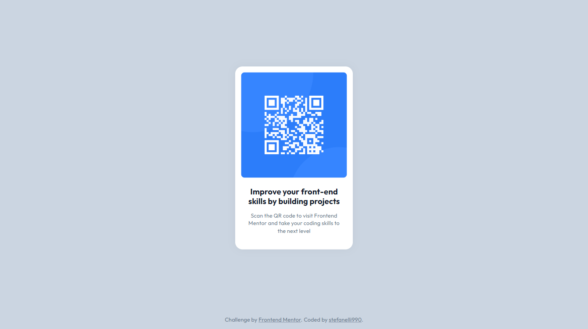

# QR Code Component

This is my solution for the [QR Code Component](https://www.frontendmentor.io/challenges/qr-code-component-iux_sIO_H). The project was completed as part of the Frontend Mentor challenges to enhance my frontend development skills.

You can view the live demo of the project [here](https://stefanelli990.github.io/qr-code-component/).
